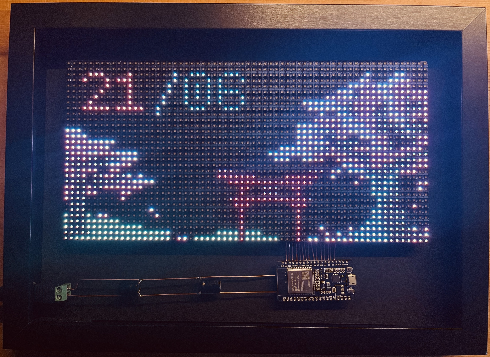
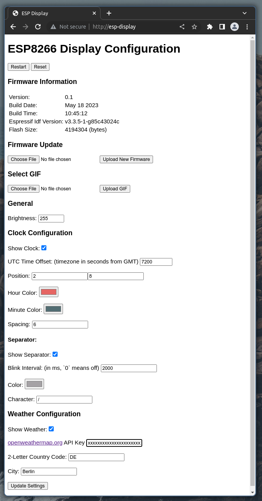

<h1><p style='text-align: center; font-family: monospace;'>ESP32-Display</p></h1>

<h3><p style='text-align: center; font-family: monospace;'>>> A GIF-playing smart-display for ESP32 microcontrollers using a 32×64 HUB75 dot matrix display <<</p></h3>

---------------

### The Product:



### Features:

- Smooth GIF-file playback
- Multiple overlay widgets:
    - [x] Clock (ntp time synchronization)
    - [ ] Weather (openweathermap, *in progress*)
    - [ ] GitHub contribution graph (*planned*)
    - [ ] Discord message count
    - [ ] ... (contribution encouraged)
- Easy configuration via Webserver
- OTA (Over-The-Air) Update

### Build:

**Resources:**

- ESP32 dev board with at least 4 Mb flash (NodeMCU, D1 mini, etc.)
- 21×30 cm wooden picture frame (e.g. IKEA "RIBBA")
- 32×64 HUB75 led dot matrix display (256×128mm)
- ~70 cm of Ø 1 mm copper wire
- Jumper wires
- DC barrel jack adapter
- 5V @ 4A DC power supply
- Black acrylic paint
- 6x M3 machine screws

**Tools:**

- Wood drill of different sizes
- Soldering Iron
- Fretsaw
- Hot-glue-gun
- PC or Laptop with Arduino IDE installed
- WiFi network

### Schematics:

> *Coming soon*

> **Warning**
> When changing the connections to the μC, remember to update the pin definitions in [`esp32-display.ino`](./esp32-display.ino)

### Code:

**Libraries:**

Please install the following Arduino libraries:

- Adafruit GFX
- AnimatedGIF
- NTPClient
- WiFi
- ESP32-HUB75-MatrixPanel-I2S-DMA
- ESP32WebServer (from [this repo](https://github.com/Pedroalbuquerque/ESP32WebServer))
- SPIFFS

**Uploading:**

Before uploading, set your WiFi's name and password in [`config.h`](./config.h). This setting can't be changed later on without reupload.

After that, select your board type, serial port, and partition scheme. I suggest leaving as much space as possible for the internal file system. Remember to also set the CPU frequency to the full 240 MHz.

**Configuration:**

Configuring the display is as easy as possible:

With the display running and successfully connected to the WiFi, open [http://esp-display](http://esp-display) in your browser. You'll be greeted with a configuration screen looking similar to this:



From this page, you can configure everything the display is capable of.

> **Note:** in case you have new ideas on what the display *could* do, please submit an issue with your idea

**Updating:**

Updating the software on the display does not require connecting it to a computer. Simply download or export the new firmware from the Arduino IDE and select it under the **`Firmware Update`** section of the configuration page. After pressing **`Upload New Firmware`**, please wait until your browser refreshes the page.

**!! Do not close the browser or shutdown your WiFi during a firmware update !!**

> **Note:** In case an update fails, you can always upload it again using the serial connection to a computer

> Software updates can be found at the **releases** tab of this repository

### Contributing:

Pull requests are welcome. For major changes, please open an issue first to discuss what you would like to change.

### License:

This project, the code (with exception of the used libraries) and all provided schematics are licensed under the [MIT License](https://mit-license.org).

See [LICENSE](./LICENSE) for further information and copying conditions.

```
THE SOFTWARE IS PROVIDED "AS IS", WITHOUT WARRANTY OF ANY KIND, EXPRESS OR
IMPLIED, INCLUDING BUT NOT LIMITED TO THE WARRANTIES OF MERCHANTABILITY,
FITNESS FOR A PARTICULAR PURPOSE AND NONINFRINGEMENT. IN NO EVENT SHALL THE
AUTHORS OR COPYRIGHT HOLDERS BE LIABLE FOR ANY CLAIM, DAMAGES OR OTHER
LIABILITY, WHETHER IN AN ACTION OF CONTRACT, TORT OR OTHERWISE, ARISING FROM,
OUT OF OR IN CONNECTION WITH THE SOFTWARE OR THE USE OR OTHER DEALINGS IN THE
SOFTWARE.
```

> Copyright © Spydr06 2023
